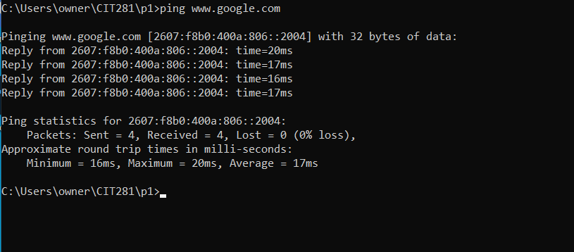

# Description

In this project I learned how access my operating systems command line interface (CLI). 
Using the CLI is a very useful technical skill to have becouse of its convinience and 
accessibility of managing and creating files. 

### Skills Used in Project
- Used the command line to create a folder structure

- Used ping to determine if a specific internet location is available

- Command line prompt to indicate the quantity of data packets to send 

- Created a javascript program on Visual Studio Code
- Created code that outputed random letters with a length between 5-25

### Link to project code
